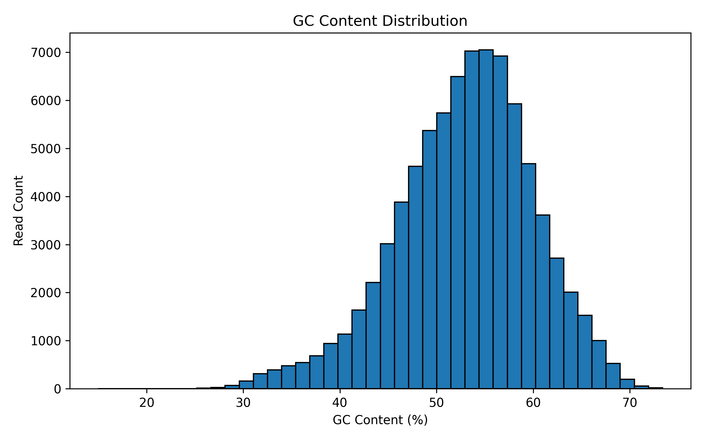
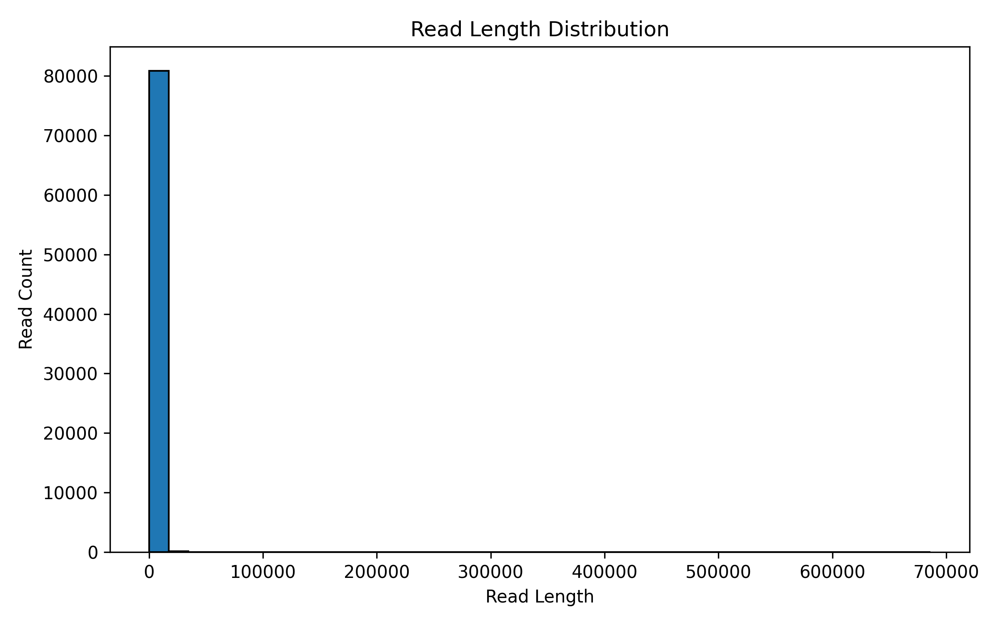
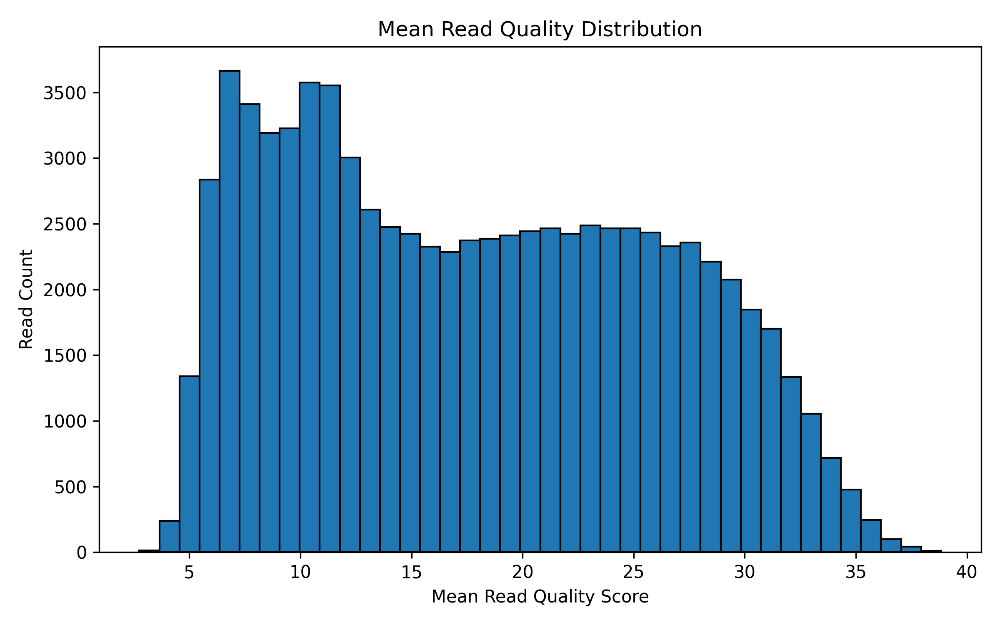

# Bioinformatics Pipeline for Long-Read Quality Control

## Project Description

This repository contains a reproducible bioinformatics pipeline developed for a mini case study.  
The goal of this project is to perform quality control analysis on long-read sequencing data and produce statistical summaries and visualizations before downstream analysis.

The workflow was implemented using **Snakemake** together with custom **Python scripts**.

---

## Objectives

The pipeline performs the following tasks:

1. Run a quality control tool designed for long-read sequencing data.
2. Calculate key statistics for each read in the FASTQ file:
   - GC content percentage
   - Read length
   - Mean read quality score
3. Save the calculated statistics in a structured CSV format.
4. Generate visualizations showing the distribution of these metrics.

---

## Quality Control Tool

This pipeline integrates **NanoPlot**, a QC tool designed for long-read sequencing technologies such as Oxford Nanopore.

NanoPlot generates several outputs including:

- read length histograms
- quality score plots
- yield plots
- an interactive HTML report

These outputs help evaluate the quality of the sequencing dataset.

---

```

## Repository Structure

Bioinformatics Pipeline for Long-Read Quality Control
│
├── Snakefile
├── environment.yml
├── README.md
│
├── scripts
│   ├── analyze_fastq.py
│   ├── filter_fastq.py
│   ├── filter_high_quality.py
│   ├── plot_distributions.py
│   └── visualize_stats.py
│
├── results
│   ├── read_stats.csv
│   ├── summary_stats.txt
│   └── qc
│
├── figures
│   ├── gc_distribution.png
│   ├── read_length_distribution.png
│   └── quality_distribution.png
│
└── communication
    └── email_to_professor.md
```

---

## Pipeline Steps

### Step 1: Quality Control

The workflow first runs **NanoPlot** to generate quality control reports for the sequencing data.

Outputs from this step are stored in:results/qc/


---

### Step 2: Read-Level Statistics

A custom Python script calculates the following metrics for each read:

- GC_Content
- Read_Length
- Mean_Quality

The results are stored in:results/read_stats.csv

This file contains one row per read with the following columns:
Read_ID
Read_Length
GC_Content
Mean_Quality


---

### Step 3: Data Visualization

A visualization script reads the statistics file and generates plots showing the distributions of the calculated metrics.

The generated plots include:

- GC content distribution
- read length distribution
- mean read quality distribution

The plots are saved in:figures/
Example output files:
figures/gc_distribution.png
figures/read_length_distribution.png
figures/quality_distribution.png

---

### Step 4: Summary Statistics

In addition to the plots, summary statistics are calculated including:

- mean
- median
- minimum
- maximum

These statistics are saved in:results/summary_stats.txt

---

## How to Run the Pipeline

Follow the steps below to reproduce the analysis.

### 1. Create the Conda environment
conda env create -f environment.yml

### 2. Activate the environment
conda activate nanopore-qc

### 3. Run the Snakemake workflow
snakemake --cores 4

This command runs the entire workflow and automatically executes all required steps.

---

## Main Outputs

The pipeline produces several outputs:

### Quality Control Results
results/qc/

### Read Statistics
results/read_stats.csv

### Summary Statistics
results/summary_stats.txt

### Visualization Outputs
figures/

## Example Output Plots

### GC Content Distribution



### Read Length Distribution



### Mean Read Quality Distribution



---

## Interpretation of Results

The generated plots provide insight into the characteristics of the sequencing dataset.

- GC content distribution shows nucleotide composition patterns.
- Read length distribution reflects the long-read nature of Nanopore sequencing.
- Mean quality score distribution provides an overview of sequencing accuracy.

These results help determine whether the dataset is suitable for downstream analysis such as read alignment.

---

## Reproducibility

This workflow is reproducible because:

- the pipeline is defined using **Snakemake**
- software dependencies are defined in **environment.yml**
- the workflow automatically generates all outputs from the input FASTQ file

---

## Author

This repository was prepared as part of a bioinformatics pipeline case study focused on building a reproducible long-read quality control workflow.


